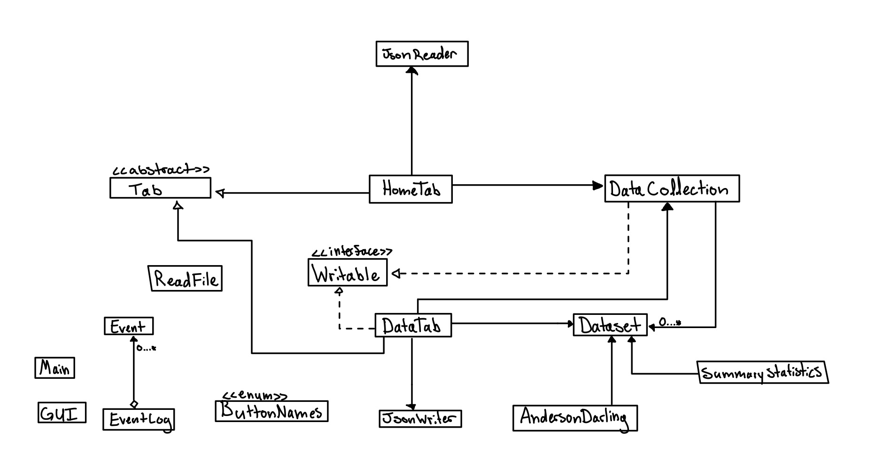

# Normal Distribution Model

## Statistical analysis of normal data

**Key computational functionality:**

- Read a given CSV
- Compute mean, standard deviation, varience, and summary statistics of data
- Compute cumulative distribiution and quantile

**Key graphical functionality:**

- Input fields for dataset, percentile, and tail selection
- Dynamically generate normal distribution plot
- Shaded region coressponding to cumulative distribution

## Who will use this application?

The intended audience is statistic students who want to build an intuition for normal models. And to make inferneces based on normal data on how the population spread implicates certain quantiles of the population.

## Why this project is of interest

I am currently enrolled in STAT 200 and MATH 101. A project like this seems like a good way to bridge the gap between the three courses as cumulative distribution calculations rely on Gaussian integrals, and of course, the main use case of the normal model is in statistical settings (as well as the fact that we have recently covered it in great detail in lecture). I think building an application like this would reinforce my learning across the three courses, and help me build an intution for the relation between the three fields of study.

## User Stories (Note, I had to tweak user stories slightly as the project progressed)

- I want to scan and store a csv, parsing it for variable of interest
- I want to represent the csv as a dataset, store it in a data collection
- I want to compute summary statistics for a given data set
- I want to check if a data follows a normal model using Anderson-Darling test (using Apache library)
- I want to cut data into chunks of interest, calculate outliers and remove them
- I want to display normal model in graphical form, give qnorm and pnorm statistical analysis (using gaussian integral in Apache library)
- I want to store csvs in an accessible and user friendly manor, enable hot swapping of csv files without having to exit the application

## User Stories for Data Persistance:

- I want to be able to save my datasets in savable data collections (if I so choose)
- I want to be able to load my data collections and traverse them, looking for the dataset I am interested in
- I want to be able to be reminded to save my data collections and have the option not to

# Instructions for End User

- You can generate the first required action related to the user story "adding multiple Xs to a Y" by adding a dataset to a data collection
- You can generate the second required action related to the user story "adding multiple Xs to a Y" by manipulating and testing datasets
- You can locate my visual component by loading the application, and navigating UI, and viewing normal data logo
- You can save the state of my application by clicking save option
- You can reload the state of my application by clicking load option upon launch

# Phase 4: Task 2

Event Log:

- Added dataset to: Untitled Collection
  Sat Mar 29 18:14:28 PDT 2025
- Retrieved dataset: data/uniform_non_normal.csv
  Sat Mar 29 18:15:09 PDT 2025
- Retrieved dataset: data/large_normal1.csv
  Sat Mar 29 18:15:25 PDT 2025
- Added dataset to: Untitled Collection
  Sat Mar 29 18:15:25 PDT 2025
- Added dataset to: Untitled Collection
  Sat Mar 29 18:15:25 PDT 2025
- Added dataset to: Untitled Collection
  Sat Mar 29 18:15:25 PDT 2025
- Retrieved dataset: data/large_normal.csv
  Sat Mar 29 18:15:26 PDT 2025
- Retrieved dataset: data/large_normal.csv
  Sat Mar 29 18:15:32 PDT 2025
- Retrieved dataset: data/large_normal.csv
  Sat Mar 29 18:15:33 PDT 2025
- Retrieved dataset: data/large_normal.csv
  Application closed

# Phase 4: Task 3

